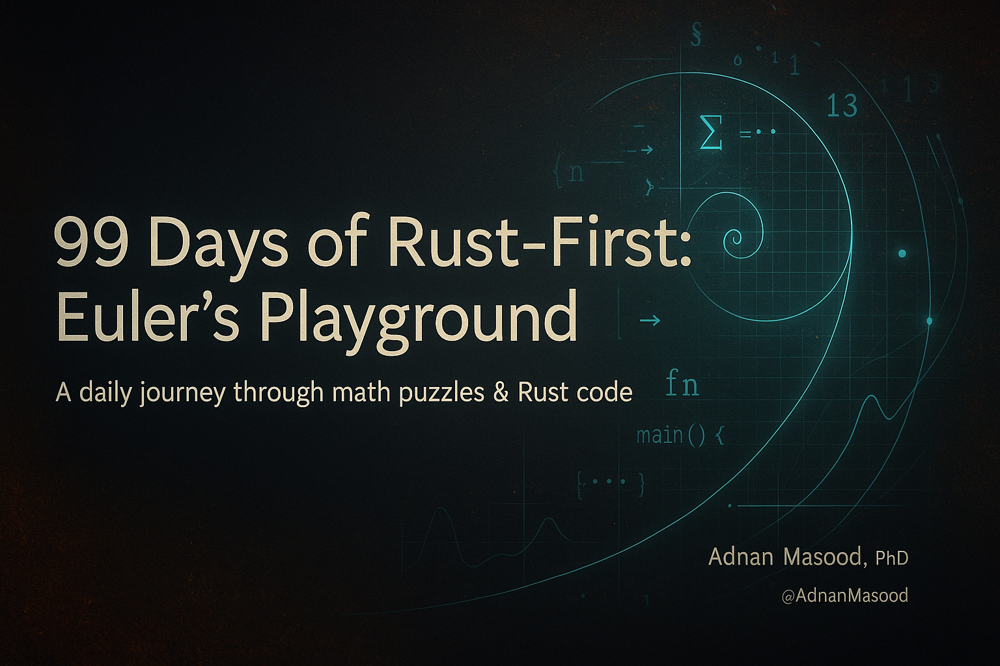

# 99 Days of Rust‑First: Euler’s Playground 🦀➗

> A daily journey through math puzzles & Rust code — by **Adnan Masood, PhD** ( *@AdnanMasood* )

<p align="center">
  
</p>

<p align="center">
  <a href="https://www.rust-lang.org/"></a>
  
  
  <a href="LICENSE"></a>
  <a href="https://github.com/adnanmasood/99-days-of-rusty-euler/issues"></a>
</p>

---

## ✨ What is this?

**Project Euler** is a collection of math‑flavored programming challenges.
This repository is a **Rust‑first tour** of 99 hand‑picked problems. Every day we:

* build the **intuition** 
* sketch the **math** 
* write a **simple** solution,
* then refactor to an **idiomatic & robust** Rust version,
* and finally mirror it in **Python** and **C++** for comparison.

We keep things friendly and human. Expect conversational asides like “you see now what I did there” when we pull a neat trick.

> 🔒 **No‑spoilers policy**: the final numeric answer for each Euler input is **never printed** in this repo or the posts. Code prints a `TODO` placeholder; tiny toy values from official statements are okay.
> 
> 🧑‍🏫 This repository respects Project Euler’s ethos and Terms: it contains original, MIT‑licensed explanations and learning‑oriented code that do not publish final numeric answers. For each challenge we paraphrase the prompt (or quote tiny illustrative values already shown on projecteuler.net) and stop one step before the last arithmetic; any println! that would reveal an answer is intentionally commented out. We focus on general techniques and Rust idioms, not solution dumps, and we limit coverage to the first 99 problems commonly used for practice. Project Euler content and trademarks remain the property of their owners; this project is unaffiliated and encourages readers to solve on the official site.
> If the Project Euler team requests edits for compliance, we’ll gladly make them.

---

## 🧭 Table of Contents

* [Project Goals](#-project-goals)
* [Repository Layout](#-repository-layout)
* [Daily Index](#-daily-index)
* [Run the Code](#-run-the-code)
* [Math Formatting](#-math-formatting)
* [Style & Teaching Philosophy](#-style--teaching-philosophy)
* [Contributing](#-contributing)
* [FAQ](#-faq)
* [License](#-license)

---

## 🎯 Project Goals

* **Learn Rust by doing** — one clean problem a day.
* **Explain simply** — high‑school‑level math and lots of intuition.
* **Showcase Rust features** — only those that help (iterators, `const`, tests… no gimmicks).
* **Leave the last step to you** — final expression ready, you finish the arithmetic.

---

## 🗂 Repository Layout

```
.
├─ assets/                      # Images (hero, diagrams)
├─ problems/
│  ├─ 01_multiples_of_3_or_5/
│  │  ├─ multiples_of_3_or_5_simple.rs
│  │  ├─ multiples_of_3_or_5_idiomatic.rs
│  │  ├─ multiples_of_3_or_5.cpp
│  │  └─ multiples_of_3_or_5.py
│  ├─ 02_even_fibonacci_numbers/
│  │  ├─ even_fibonacci_numbers_simple.rs
│  │  ├─ even_fibonacci_numbers_idiomatic.rs
│  │  ├─ even_fibonacci_numbers.cpp
│  │  └─ even_fibonacci_numbers.py
│  └─ ... (03..99)
├─ templates/
│  └─ new_problem_skeleton/     # starter files for a new day
├─ posts/                       # Markdown posts (same structure as problems/)
│  └─ 02_even_fibonacci_numbers.md
├─ README.md
└─ LICENSE
```

> 🧩 Each problem folder contains:
>
> * `*_simple.rs` — the “do what it says” version (clear & direct).
> * `*_idiomatic.rs` — a refined Rust solution with comments & tiny tests.
> * `*.cpp`, `*.py` — compact mirrors for comparison (commented final prints).

---

## 📅 Daily Index

**Progress:** `2 / 99` `[▓▓░░░░░░░░░░░░░░░░░░░░]`

<details>
<summary><strong>Open the full day list</strong></summary>

* ✅ **Day 01** — *The 3–5 Junction* (Euler #1) → `problems/01_multiples_of_3_or_5/`
* ✅ **Day 02** — *Even Steps on the Golden Staircase* (Euler #2) → `problems/02_even_fibonacci_numbers/`
* ⬜ Day 03 — *(coming soon)*
* ⬜ Day 04 — *(coming soon)*
* ⬜ …
* ⬜ Day 99 — *(coming soon)*

</details>

---

## ▶️ Run the Code

> All final prints are commented out to respect the **no‑spoilers** rule.
> Uncomment locally to compute the final number.

### 🦀 Rust (2021 edition)

**Option A — compile a single file:**

```bash
cd problems/02_even_fibonacci_numbers
rustc even_fibonacci_numbers_idiomatic.rs -O -o even_fib
./even_fib
```

**Option B — with Cargo (recommended multi‑bin layout):**

```bash
# Example if you set up a Cargo workspace with each day as a bin target
cargo run --bin even_fibonacci_numbers --release
```

### 🐍 Python 3.x

```bash
cd problems/02_even_fibonacci_numbers
python3 even_fibonacci_numbers.py
```

### 🧰 C++17

```bash
cd problems/02_even_fibonacci_numbers
g++ -std=c++17 -O2 -Wall -Wextra -o even_fib even_fibonacci_numbers.cpp
./even_fib
```

---

## 🧮 Math Formatting

Medium‑friendly, plain Markdown/ASCII equations (no LaTeX dependency):

```
S(n) = n * (n + 1) / 2
m_k = floor((N - 1) / k)
S_k(N) = k * m_k * (m_k + 1) / 2
lcm(a,b) = a * b / gcd(a,b)
S = S_a + S_b - S_lcm(a,b)
```

* `*` multiply, `/` divide, `^` power if needed.
* Use `floor(...)`, `ceil(...)` as plain words.
* For sets, `|A ∩ B|` or `|A n B|` if you want pure ASCII.

---

## 🧑‍🏫 Style & Teaching Philosophy

* **Explain first** — small examples, analogies, and pictures in your head.
* **Name ideas** — `is_interesting`, `sum_multiples_below`, etc. The code should read like English.
* **Separate policy from mechanics** — the *what* (predicates) vs the *how* (iteration/recurrence).
* **Prove by tiny tests** — quick `#[test]`s for the official toy examples.
* **Type safety as clarity** — pick numeric types that make overflows unlikely (`u128` where useful).

---

## 🧪 Template (start a new day quickly)

```
problems/NN_slug/
├─ slug_simple.rs            # direct, readable baseline
├─ slug_idiomatic.rs         # refined Rust with tests
├─ slug.cpp                  # compact C++17 mirror
└─ slug.py                   # compact Python mirror
```

**Rust skeleton (`slug_simple.rs`):**

```rust
// slug_simple.rs
fn solve() -> u64 {
    // TODO: direct, readable solution here
    0
}

fn main() {
    // println!("{}", solve()); // TODO: uncomment locally (no spoilers)
    println!("TODO: compute locally");
}
```

**Rust tests (drop inside `slug_idiomatic.rs`):**

```rust
#[cfg(test)]
mod tests {
    use super::*;
    #[test]
    fn tiny_example() {
        // TODO: assert known toy value from the official statement
        // assert_eq!(solve_for(10), 23);
    }
}
```

---

## 🤝 Contributing

PRs are welcome!
If you’d like to add a day, fix a typo, or improve an explanation:

1. **Fork** → create a feature branch.
2. Follow the **template** above; please keep:

   * direct baseline → idiomatic Rust → C++/Python mirrors,
   * **no spoilers** (comment out final prints),
   * plain Markdown equations.
3. Add a short note to the [Daily Index](#-daily-index).
4. Open a PR. We’ll review with an eye for clarity and learning value.

> For a larger addition, open an issue first so we can align on direction.

---

## ❓ FAQ

**Q: Why not print the final Euler numbers?**
A: Discovery is the point. We lead you to the last line (`2 + 2 =`) and stop. You do the last click.

**Q: Why Rust?**
A: It composes beautifully: iterators for clarity, types for safety, tests for trust. Also, 🦀.

**Q: Do I need advanced math?**
A: No. We keep it high‑school friendly and explain terms (e.g., **bounds**, **time complexity**, **cyclomatic complexity**) in plain language.

**Q: Can I follow with Python or C++ only?**
A: Sure. Rust is the star, but we ship mirrors to compare approaches.

---

## 📜 License

This project is released under the **MIT License**. See [LICENSE](LICENSE).

---

<p align="center">
  Built with curiosity, clear explanations, and plenty of 🦀 + ∑.
  <br>
  <sub>© Adnan Masood, PhD · <a href="https://github.com/adnanmasood/99-days-of-rusty-euler">GitHub repo</a></sub>
</p>
